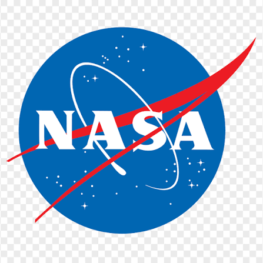

# 🚀 NASA Explorer

<p align="center">
  
</p>

<p align="center">
A modern, immersive NASA-inspired web experience built with <strong>Next.js 16</strong>, <strong>TypeScript</strong>, and the official <strong>NASA Open APIs</strong>.
</p>

---

## 🌌 Live Demo

🔗 https://nasa-explorer-beta-coral.vercel.app/

---

## ✨ Overview

NASA Explorer is a modern frontend application inspired by NASA's missions, astronomy, and space exploration.

The project combines smooth animations, immersive visuals, production-ready architecture, and real NASA data to deliver a premium browsing experience.

Designed with performance, scalability, and clean architecture in mind.

---

# ✨ Features

- 🚀 Beautiful Landing Page
- 🌌 Galaxy Animated Background
- ⭐ Mouse Reactive Star Effects
- 🎨 Modern Glassmorphism UI
- 📱 Fully Responsive Design
- 🌍 Earth Gallery
- 🔴 Mars Exploration
- 🔭 Astronomy Picture of the Day (NASA APOD)
- 🛰 NASA Missions
- 📖 NASA History Timeline
- 🖼 Space Gallery
- ⚡ Lazy Loading
- 🧠 API Caching
- 🎬 Smooth Page Transitions
- ⚙️ Optimized for Production
- ♿ Accessible UI

---

# 🛰 NASA APIs

This project integrates official NASA APIs including:

- Astronomy Picture of the Day (APOD)
- Mars Rover Photos
- NASA Image & Video Library

---

# 🛠 Tech Stack

## Frontend

- Next.js 16
- React
- TypeScript
- Tailwind CSS
- Framer Motion

## API

- NASA Open APIs

## Deployment

- Vercel

---

# 📂 Project Structure

```
src/
 ├── app/
 ├── components/
 ├── assets/
 ├── lib/
 ├── hooks/
 └── types/

public/
 ├── backgrounds/
 ├── missions/
 ├── pages/
 └── earth/
```

---

# ⚡ Performance

- Optimized Images
- Lazy Loading
- Route Prefetching
- Production Build Optimized
- Dynamic Imports
- Smooth Animations
- Optimized Rendering
- Responsive Layout

---

# 🚀 Local Development

Clone the repository

```bash
git clone https://github.com/mralirezaazarparand/nasa-explorer.git
```

Install dependencies

```bash
npm install
```

Create

```
.env.local
```

Add

```env
NASA_API_KEY=YOUR_API_KEY
```

Run development server

```bash
npm run dev
```

Production build

```bash
npm run build
npm run start
```

---

# 📸 Screenshots

> Add screenshots here after the project is finalized.

Example:

```
screenshots/

missions.png

astronomy.png

gallery.png

```

---

# 🌍 Deployment

This project is deployed on **Vercel**.

Live Website

https://nasa-explorer-beta-coral.vercel.app/

---

# 👨‍💻 Author

**Alireza Azarparand**

GitHub

https://github.com/mralirezaazarparand

LinkedIn

https://www.linkedin.com/in/alireza-azarparand/

---

# ⭐ If you like this project

Give it a ⭐ on GitHub!

---

# 📄 License

This project is licensed under the MIT License.
